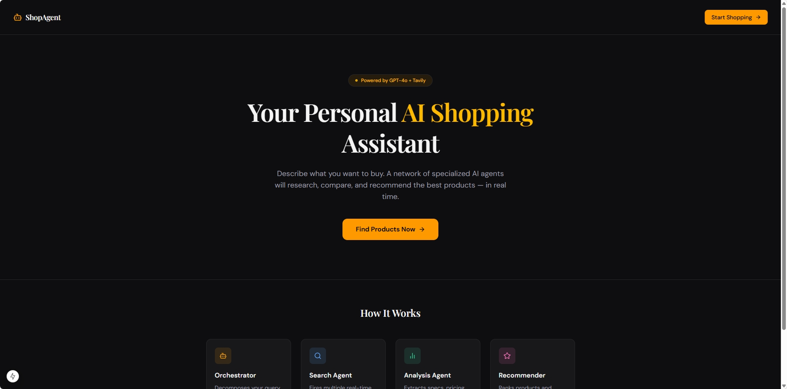
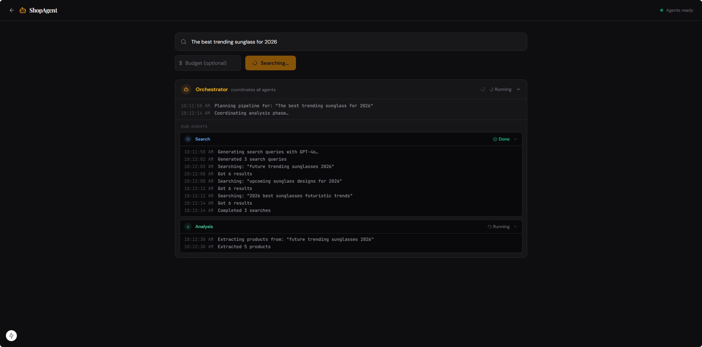
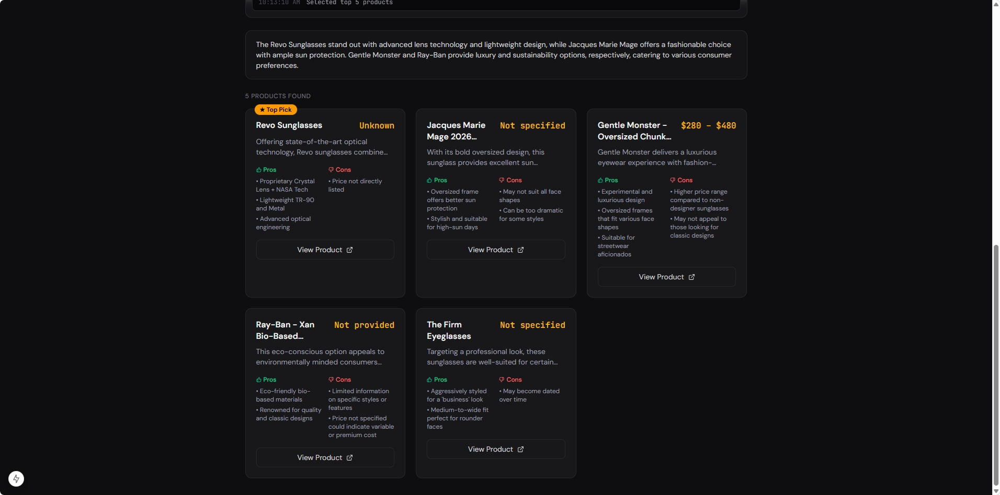

# Multi-Agent Shopping Assistant

> AI-powered shopping assistant built with a multi-agent architecture.
> **Backend:** FastAPI · **Frontend:** Next.js + shadcn/ui · **LLMs:** OpenAI · **Search:** Tavily



---

## Overview

Users describe what they want to buy; a network of specialized AI agents collaborates to research, compare, and recommend products with real-time web data.

### Agent Architecture

```
User Query
    │
    ▼
┌─────────────────────────────────────────────────────┐
│                  Orchestrator Agent                 │
│  (GPT-4o · routes tasks, aggregates results)        │
└──────┬──────────┬───────────────┬───────────────────┘
       │          │               │
       ▼          ▼               ▼
 ┌──────────┐ ┌──────────┐ ┌──────────────┐
 │  Search  │ │ Analysis │ │ Recommender  │
 │  Agent   │ │  Agent   │ │    Agent     │
 │ (Tavily) │ │ (GPT-4o) │ │  (GPT-4o)    │
 └──────────┘ └──────────┘ └──────────────┘
```

- **Orchestrator** — decomposes queries, fans out tasks, merges results
- **Search Agent** — real-time product search via Tavily API
- **Analysis Agent** — extracts specs, price, pros/cons from raw results
- **Recommender Agent** — ranks products and generates user-facing justification

---

## Quick Start

### Prerequisites

- Python 3.12+
- Node.js 22+
- [pnpm](https://pnpm.io/installation) (`npm install -g pnpm` or `corepack enable`)
- [uv](https://docs.astral.sh/uv/) (`curl -LsSf https://astral.sh/uv/install.sh | sh`)
- OpenAI API key
- Tavily API key

### Backend

```bash
cd backend

# Install dependencies
uv sync

# Configure environment
cp .env.example .env
# Edit .env and set OPENAI_API_KEY and TAVILY_API_KEY

# Run dev server
uv run uvicorn app.main:app --reload --port 8000
```

### Frontend

```bash
cd frontend

# Install dependencies
pnpm install

# Configure environment
cp .env.local.example .env.local
# NEXT_PUBLIC_API_URL is already set to http://localhost:8000

# Run dev server
pnpm dev
```

### Run Both Concurrently

```bash
# From the root directory (requires concurrently: pnpm add -g concurrently)
concurrently \
  "cd backend && uv run uvicorn app.main:app --reload" \
  "cd frontend && pnpm dev"
```

Open [http://localhost:3000](http://localhost:3000) in your browser.



---

## API Reference

### `POST /api/v1/search`

```json
// Request
{
  "query": "wireless noise-cancelling headphones under $200",
  "budget": 200,
  "currency": "USD",
  "max_results": 5
}

// Response
{
  "query": "...",
  "products": [
    {
      "title": "Sony WH-1000XM4",
      "price": "$199",
      "url": "https://...",
      "pros": ["Best-in-class ANC", "30hr battery"],
      "cons": ["Touch controls finicky"],
      "score": 0.94,
      "reasoning": "Industry-leading noise cancellation at the top of your budget."
    }
  ],
  "summary": "Found 5 strong options. Sony leads on ANC quality.",
  "search_queries_used": ["best noise cancelling headphones 2025 under 200"],
  "agent_trace": ["Orchestrator: decomposed query", "Search: 3 queries fired"]
}
```

### `POST /api/v1/search/stream`

Same request body. Returns Server-Sent Events:

```
data: {"type": "agent_event", "event": {"agent": "search", "status": "thinking", ...}}
data: {"type": "agent_event", "event": {"agent": "analysis", "status": "done", ...}}
data: {"type": "result", "result": { ... }}
```

### `GET /health`

```json
{ "status": "ok" }
```



---

## Environment Variables

### Backend (`backend/.env`)

| Variable                  | Required | Default    | Description           |
| ------------------------- | -------- | ---------- | --------------------- |
| `OPENAI_API_KEY`        | Yes      | —         | OpenAI API key        |
| `TAVILY_API_KEY`        | Yes      | —         | Tavily search API key |
| `OPENAI_MODEL`          | No       | `gpt-4o` | OpenAI model to use   |
| `MAX_SEARCH_RESULTS`    | No       | `5`      | Max products returned |
| `AGENT_TIMEOUT_SECONDS` | No       | `30`     | Per-agent timeout     |

### Frontend (`frontend/.env.local`)

| Variable                | Required | Default                   | Description      |
| ----------------------- | -------- | ------------------------- | ---------------- |
| `NEXT_PUBLIC_API_URL` | Yes      | `http://localhost:8000` | Backend base URL |

---

## Development

### Backend Checks

```bash
cd backend

# Lint + format
uv run ruff check . --fix && uv run ruff format .

# Type check
uv run mypy app/

# Tests
uv run pytest
```

### Frontend Checks

```bash
cd frontend

pnpm lint
pnpm type-check
pnpm build
```

---

## Tech Stack

| Layer                   | Technology              |
| ----------------------- | ----------------------- |
| Backend framework       | FastAPI                 |
| LLM                     | OpenAI GPT-4o           |
| Search                  | Tavily                  |
| Data validation         | Pydantic v2             |
| Python tooling          | uv, ruff, mypy          |
| Node.js package manager | pnpm                    |
| Frontend framework      | Next.js 15 (App Router) |
| UI components           | shadcn/ui               |
| Styling                 | Tailwind CSS v4         |
| Animations              | Framer Motion           |
| Language                | TypeScript (strict)     |

---

## Portfolio Highlights

- **Multi-agent orchestration** — fan-out/fan-in pattern, async parallel execution
- **Streaming UX** — real-time SSE agent events keep the UI alive during inference
- **Type safety end-to-end** — Pydantic v2 backend, TypeScript strict mode frontend
- **Modern Python tooling** — `uv`, `ruff`, `mypy`
- **Production patterns** — structured logging, graceful error handling, env-based config
